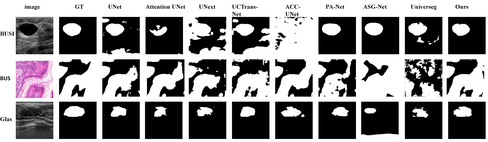

<div align="center">
<h1>MatchSeg: <br>Towards Better Segmentation via Reference Image Matching </h1>
This is the official Pytorch implementation of our paper "MatchSeg".
<br>
  
<!-- <image src="docs/teaser.jpg" width="720px" /> -->
<br>

</div>

## Abstract
Automated medical image segmentation methods heavily rely on large annotated datasets, which are costly and time-consuming to acquire. Inspired by few-shot learning, we introduce MatchSeg, a novel framework that enhances medical image segmentation through strategic reference image matching.
## Installation
### Requirenments
* Linux, CUDA>=11.0, PyTorch >= 1.8.1 [The results are tested on pytorch 1.10.1.]
* Other requirements
    ```bash
    pip install open-clip-torch
    pip install scikit-learn
    pip install opencv-python
    pip install albumentations
    pip install matplotlib
    pip install tensorboard
    # pip uninstall setuptools
    # pip install setuptools==59.5.0
    pip install einops
    pip install pydantic
    ```

### Prepare datasets for MatchSeg
The training of our model uses [HAM-10000](https://dataverse.harvard.edu/dataset.xhtml?persistentId=doi:10.7910/DVN/DBW86T), [GlaS](https://www.kaggle.com/datasets/sani84/glasmiccai2015-gland-segmentation), [Breast Ultrasound Dataset B(BUS)](http://www2.docm.mmu.ac.uk/STAFF/M.Yap/dataset.php), [BUSI](https://scholar.cu.edu.eg/?q=afahmy/pages/dataset) datasets.

We prepare the datasets as the more easy ways for training and you can download it from this dataset [link](https://pan.baidu.com/s/1Z0XKf6HbQc-a2oCCxB0Xkg) (Password: yp9e). The dataset should be saved to $ROOT/datasets

-  HAM10000 Dataset Preparation
    - Due to the HAM10000 dataset being provided without differentiation among its seven categories (actinic keratoses and intraepithelial carcinoma (AKIEC), basal cell carcinoma (BCC), benign keratosis-like lesions (BKL), dermatofibroma (DF), melanoma (MEL), melanocytic nevi (NV), and vascular lesions (VASC)), it is necessary to execute the script below to separate the images and masks into their respective categories.
    - Run the following script to categorize images and masks into the different categories:
        ```python
        python datasets/HAM10000_spilt.py
        ```


After processing, the datasets should be organized as follows:
```
├─bus
│  ├─images
│  └─masks
├─busi
│  ├─images
│  └─masks
├─glas
│  ├─images
│  └─masks
└─HAM10000
    ├─AKIEC
    │  ├─images
    │  └─masks
    ├─BCC
    │  ├─images
    │  └─masks
    ├─BKL
    │  ├─images
    │  └─masks
    ├─DF
    │  ├─images
    │  └─masks
    ├─MEL
    │  ├─images
    │  └─masks
    ├─NV
    │  ├─images
    │  └─masks
    └─VASC
        ├─images
        └─masks
```

## Training

We use single RTX3090/4090 for training:
```bash
bash train_single_domain.sh
bash train_cross_domain.sh
```

## Results
#### Quantitative results on BUSI, BUS, and GlaS datasets. 
<table border="1" width="100%">
    <!-- <caption>Quantitative results on BUSI, BUS, and GlaS datasets</caption> -->
    <thead>
        <tr align="center">
            <th rowspan="2">Model</th>
            <th rowspan="2">Params(M)</th>
            <th colspan="2">BUSI</th>
            <th colspan="2">BUS</th>
            <th colspan="2">GlaS</th>
        </tr>
        <tr align="center">
            <th>DSC%</th>
            <th>IOU%</th>
            <th>DSC%</th>
            <th>IOU%</th>
            <th>DSC%</th>
            <th>IOU%</th>
        </tr>
    </thead>
    <tbody>
        <tr align="center">
            <td>UNet</td>
            <td>34.53</td>
            <td>79.29</td>
            <td>71.14</td>
            <td>89.08</td>
            <td>81.73</td>
            <td>89.58</td>
            <td>82.16</td>
        </tr>
        <tr align="center">
            <td>AttentionUNet</td>
            <td>34.88</td>
            <td>79.35</td>
            <td>71.28</td>
            <td>88.12</td>
            <td>80.45</td>
            <td>90.00</td>
            <td>82.80</td>
        </tr>
        <tr align="center">
            <td>ACC-UNet</td>
            <td>16.77</td>
            <td>74.59</td>
            <td>65.39</td>
            <td>71.16</td>
            <td>58.98</td>
            <td>77.82</td>
            <td>64.88</td>
        </tr>
        <tr align="center">
            <td>UNext</td>
            <td>1.47</td>
            <td>69.50</td>
            <td>58.80</td>
            <td>70.74</td>
            <td>58.68</td>
            <td>80.96</td>
            <td>69.08</td>
        </tr>
        <tr align="center">
            <td>UCTransNet</td>
            <td>66.34</td>
            <td>78.17</td>
            <td>69.02</td>
            <td>87.96</td>
            <td>79.86</td>
            <td>88.53</td>
            <td>80.15</td>
        </tr>
        <tr align="center">
            <td>PA-Net</td>
            <td>8.94</td>
            <td>77.02</td>
            <td>67.63</td>
            <td>81.19</td>
            <td>70.45</td>
            <td>84.89</td>
            <td>74.54</td>
        </tr>
        <tr align="center">
            <td>ASG-Net</td>
            <td>34.06</td>
            <td>50.60</td>
            <td>42.40</td>
            <td>81.14</td>
            <td>70.46</td>
            <td>73.51</td>
            <td>59.28</td>
        </tr>
        <tr align="center">
            <td>UniverSeg</td>
            <td>1.18</td>
            <td>52.14</td>
            <td>40.21</td>
            <td>59.85</td>
            <td>48.42</td>
            <td>60.79</td>
            <td>44.79</td>
        </tr>
        <tr align="center">
            <td>MatchSeg (ours)</td>
            <td>7.79</td>
            <td><b>81.03</b></td>
            <td><b>72.56</b></td>
            <td><b>90.58</b></td>
            <td><b>83.23</b></td>
            <td><b>90.92</b></td>
            <td><b>84.04</b></td>
        </tr>
    </tbody>
</table>

#### Cross-domain segmentation results on BUSI and BUS datasets. A $\rightarrow$ B indicates A for training and B for testing.

<table border="1" width="100%">
    <!-- <caption>Cross-domain segmentation results on BUSI and BUS datasets. A &#8594; B indicates A for training and B for testing.</caption> -->
    <thead>
        <tr align="center">
            <th rowspan="2">Models</th>
            <th rowspan="2">Params (M)</th>
            <th colspan="2">BUSI &#8594; BUS</th>
            <th colspan="2">BUS &#8594; BUSI</th>
        </tr>
        <tr align="center">
            <th>DSC%</th>
            <th>IOU%</th>
            <th>DSC%</th>
            <th>IOU%</th>
        </tr>
    </thead>
    <tbody>
        <tr align="center">
            <td>UNet</td>
            <td>34.53</td>
            <td>74.72</td>
            <td>67.16</td>
            <td><u>56.85</u></td>
            <td><u>49.36</u></td>
        </tr>
        <tr align="center">
            <td>AttentionUNet</td>
            <td>34.88</td>
            <td><u>76.18</u></td>
            <td><u>67.66</u></td>
            <td><u>56.85</u></td>
            <td>49.32</td>
        </tr>
        <tr align="center">
            <td>ACC-UNet</td>
            <td>16.77</td>
            <td>61.62</td>
            <td>53.55</td>
            <td>42.81</td>
            <td>33.79</td>
        </tr>
        <tr align="center">
            <td>UNext</td>
            <td>1.47</td>
            <td>56.37</td>
            <td>47.30</td>
            <td>39.93</td>
            <td>30.92</td>
        </tr>
        <tr align="center">
            <td>UCTransNet</td>
            <td>66.34</td>
            <td>67.52</td>
            <td>58.21</td>
            <td>54.91</td>
            <td>47.16</td>
        </tr>
        <tr align="center">
            <td>PA-Net</td>
            <td>8.94</td>
            <td>70.99</td>
            <td>61.80</td>
            <td>49.15</td>
            <td>40.28</td>
        </tr>
        <tr align="center">
            <td>ASG-Net</td>
            <td>34.06</td>
            <td>47.23</td>
            <td>34.96</td>
            <td>49.70</td>
            <td>40.44</td>
        </tr>
        <tr align="center">
            <td>UniverSeg</td>
            <td>1.18</td>
            <td>51.75</td>
            <td>40.91</td>
            <td>35.19</td>
            <td>26.05</td>
        </tr>
        <tr align="center">
            <td>MathcSeg (ours)</td>
            <td>7.79</td>
            <td><b>78.07</b></td>
            <td><b>68.86</b></td>
            <td><b>59.27</b></td>
            <td><b>51.53</b></td>
        </tr>
    </tbody>
</table>

#### Cross-domain segmentation results on the HAM10000 dataset. Note that all models were trained on the NV lesion type.

<table border="1" width="100%">
    <caption>Cross-domain segmentation results on the HAM10000 dataset. Note that all models were trained on the NV lesion type.</caption>
    <thead>
        <tr align="center">
            <th rowspan="2">Models</th>
            <th rowspan="2">Params (M)</th>
            <th colspan="6">Results</th>
            <th rowspan="2">Average</th>
        </tr>
        <tr align="center">
            <th>AKIEC</th>
            <th>AKIEC</th>
            <th>BKL</th>
            <th>DF</th>
            <th>MEL</th>
            <th>VASC</th>
        </tr>
    </thead>
    <tbody>
        <tr align="center">
            <td>UNet</td>
            <td>34.53</td>
            <td>75.16</td>
            <td>68.07</td>
            <td>84.67</td>
            <td><u>83.50</u></td>
            <td>91.20</td>
            <td>81.99</td>
            <td>83.19</td>
        </tr>
        <tr align="center">
            <td>AttentionUNet</td>
            <td>34.88</td>
            <td>76.72</td>
            <td>69.61</td>
            <td>85.04</td>
            <td>83.00</td>
            <td><u>92.14</u></td>
            <td><b>83.71</b></td>
            <td>84.08</td>
        </tr>
        <tr align="center">
            <td>ACC-UNet</td>
            <td>16.77</td>
            <td>72.77</td>
            <td>64.71</td>
            <td>84.15</td>
            <td>80.39</td>
            <td>90.45</td>
            <td>82.91</td>
            <td>82.96</td>
        </tr>
        <tr align="center">
            <td>UNext</td>
            <td>1.47</td>
            <td>79.75</td>
            <td><u>70.83</u></td>
            <td>85.73</td>
            <td>83.17</td>
            <td>91.10</td>
            <td>79.39</td>
            <td>84.26</td>
        </tr>
        <tr align="center">
            <td>UCTransNet</td>
            <td>66.34</td>
            <td><u>80.31</u></td>
            <td>71.91</td>
            <td><u>86.18</u></td>
            <td><b>83.82</b></td>
            <td><b>92.23</b></td>
            <td><u>82.72</u></td>
            <td><u>85.19</u></td>
        </tr>
        <tr align="center">
            <td>PA-Net</td>
            <td>8.94</td>
            <td>72.22</td>
            <td>68.02</td>
            <td>83.76</td>
            <td>80.70</td>
            <td>89.34</td>
            <td>80.53</td>
            <td>81.83</td>
        </tr>
        <tr align="center">
            <td>ASG-Net</td>
            <td>34.06</td>
            <td>51.39</td>
            <td>40.26</td>
            <td>45.33</td>
            <td>48.45</td>
            <td>50.27</td>
            <td>31.55</td>
            <td>46.42</td>
        </tr>
        <tr align="center">
            <td>UniverSeg</td>
            <td>1.18</td>
            <td>74.36</td>
            <td>66.78</td>
            <td>77.59</td>
            <td>77.37</td>
            <td>82.99</td>
            <td>74.39</td>
            <td>77.17</td>
        </tr>
        <tr align="center">
            <td>MathcSeg (ours)</td>
            <td>7.79</td>
            <td><b>80.82</b></td>
            <td><b>73.53</b></td>
            <td><b>86.44</b></td>
            <td>82.97</td>
            <td>91.64</td>
            <td>82.28</td>
            <td><b>85.33</b></td>
        </tr>    
    </tbody>
</table>

Note: Best is bold.

The improved segmentation performance is also reflected in the example predictions as shown below.




## To do
- [x] Environment Settings
- [ ] Dataset Links
- [ ] CLIP-guided Selection
- [ ] Training Pipeline
- [ ] Citation Link

## Citation
If this code is helpful for your study, please cite:

```
```

## Acknowledgement
[open_clip](https://github.com/mlfoundations/open_clip), [Universeg](https://github.com/JJGO/UniverSeg)
